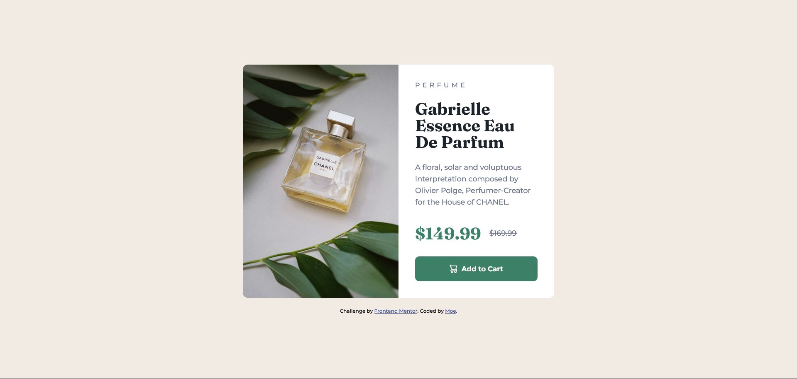
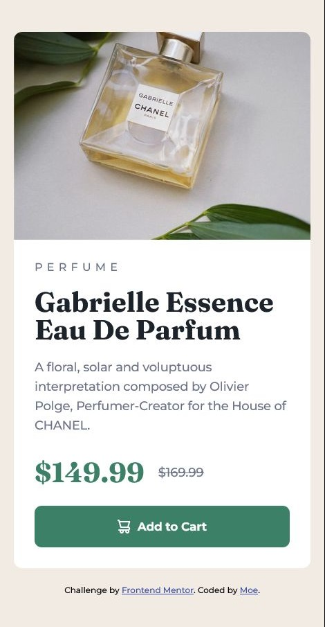

# Frontend Mentor - Product preview card component solution

This is a solution to the [Product preview card component challenge on Frontend Mentor](https://www.frontendmentor.io/challenges/product-preview-card-component-GO7UmttRfa). Frontend Mentor challenges help you improve your coding skills by building realistic projects.

## Table of contents

- [Overview](#overview)
  - [The challenge](#the-challenge)
  - [Screenshot](#screenshot)
  - [Links](#links)
- [My process](#my-process)
  - [Built with](#built-with)
  - [What I learned](#what-i-learned)
  - [Continued development](#continued-development)
  - [Useful resources](#useful-resources)
- [Author](#author)
- [Acknowledgments](#acknowledgments)

**Note: Delete this note and update the table of contents based on what sections you keep.**

## Overview

### The challenge

Users should be able to:

- View the optimal layout depending on their device's screen size
- See hover and focus states for interactive elements

### Screenshot

### Desktop View



### Desktop View with Hover State


### Mobile View



### Links

- Solution URL: [Add solution URL here](https://your-solution-url.com)
- Live Site URL: [Add live site URL here](https://your-live-site-url.com)

## My process

### Built with

- Semantic HTML5 markup
- CSS custom properties
- Flexbox
- Mobile-first workflow
- Responsive design principles

### What I learned

This project helped me strengthen my understanding of responsive design principles. I learned how to effectively implement a mobile-first approach and use media queries to adapt the layout for different screen sizes.

One of the most valuable techniques I learned was using the `picture` element to serve different images based on screen size:

```html
<picture>
  <source
    srcset="./images/image-product-desktop.jpg"
    media="(min-width: 600px)"
  />
  
</picture>
```

I also improved my CSS skills by using custom properties (variables) to maintain consistent colors and styling throughout the project:

```css
:root {
  /* Primary Colors */
  --color-primary: hsl(158, 36%, 37%);
  --color-primary-dark: hsl(158, 42%, 18%);
  --color-background: hsl(30, 38%, 92%);

  /* Neutral Colors */
  --color-heading: hsl(212, 21%, 14%);
  --color-text: hsl(228, 12%, 48%);
  --color-white: hsl(0, 0%, 100%);
}
```

Creating an effective responsive layout with Flexbox was another important skill I practiced:

```css
@media (min-width: 600px) {
  .product-card {
    display: flex;
    max-width: 600px;
  }

  .product-image,
  .product-content {
    width: 50%;
  }
}
```

If you want more help with writing markdown, we'd recommend checking out [The Markdown Guide](https://www.markdownguide.org/) to learn more.

**Note: Delete this note and the content within this section and replace with your own learnings.**

### Continued development

Use this section to outline areas that you want to continue focusing on in future projects. These could be concepts you're still not completely comfortable with or techniques you found useful that you want to refine and perfect.

**Note: Delete this note and the content within this section and replace with your own plans for continued development.**

### Useful resources

- [Grafikart - Responsive Images Tutorial](https://grafikart.fr/tutoriels/images-responsive-1152) - This article taught me how to implement responsive images effectively.
- [W3Schools - HTML5 Semantic Elements](https://www.w3schools.com/html/html5_semantic_elements.asp) - A great reference for understanding and implementing semantic HTML5 elements for better accessibility and structure.
- [BrowserStack - CSS and Media Query Breakpoints](https://www.browserstack.com/guide/what-are-css-and-media-query-breakpoints) - A comprehensive guide that explained the concept of breakpoints in modern responsive design.
- [REM to PX Converter](https://remtopx.com/) - A useful tool for converting between REM and PX units which helped me maintain consistent spacing.

**Note: Delete this note and replace the list above with resources that helped you during the challenge. These could come in handy for anyone viewing your solution or for yourself when you look back on this project in the future.**

## Author

- Website - [Add your name here](https://www.your-site.com)
- Frontend Mentor - [@yourusername](https://www.frontendmentor.io/profile/yourusername)
- Twitter - [@yourusername](https://www.twitter.com/yourusername)

## Acknowledgments

This is where you can give a hat tip to anyone who helped you out on this project. Perhaps you worked in a team or got some inspiration from someone else's solution. This is the perfect place to give them some credit.

**Note: Delete this note and edit this section's content as necessary. If you completed this challenge by yourself, feel free to delete this section entirely.**
